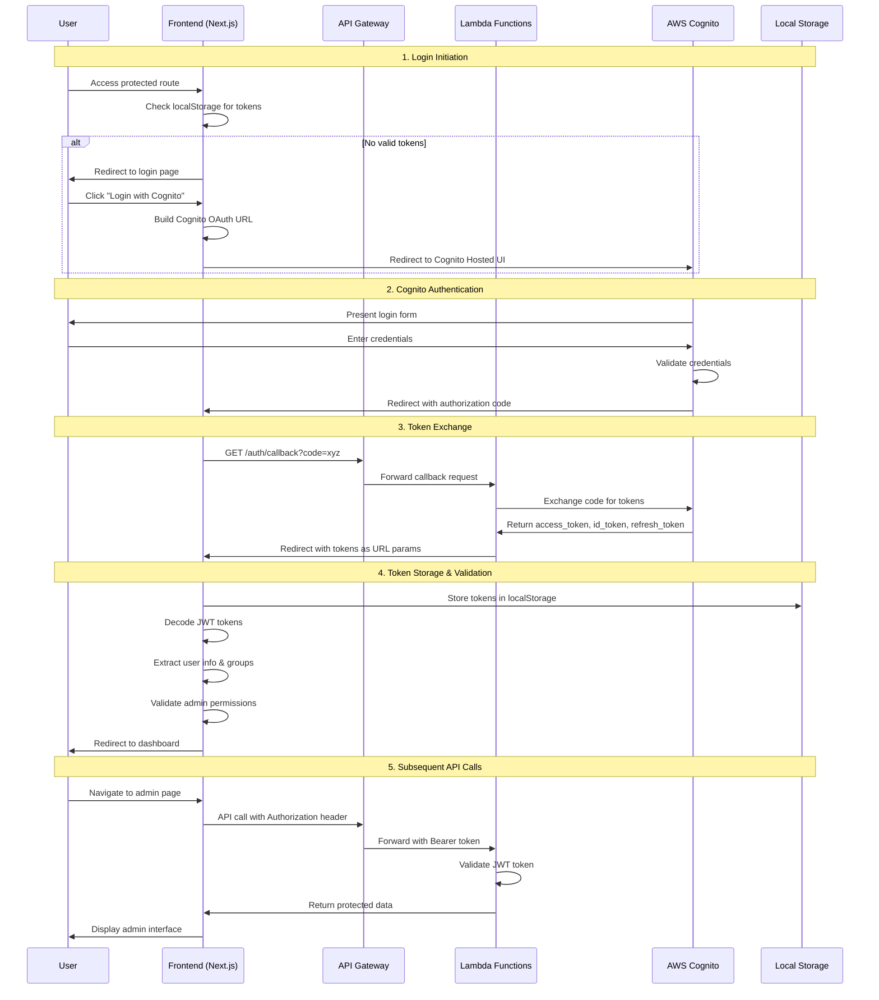

# Pi Admin Dashboard - AWS Cognito Authentication

This document provides a comprehensive overview of how AWS Cognito authentication is implemented in the Pi Admin Dashboard, including detailed flow diagrams, JWT token handling, and session management.

## Table of Contents

- [Architecture Overview](#architecture-overview)
- [Authentication Flow](#authentication-flow)
- [Lambda Functions](#lambda-functions)
- [JWT Token Management](#jwt-token-management)
- [Session Management](#session-management)
- [Role-Based Access Control](#role-based-access-control)
- [Security Implementation](#security-implementation)
- [Environment Configuration](#environment-configuration)
- [Error Handling](#error-handling)
- [Troubleshooting](#troubleshooting)

## Architecture Overview

The Pi Admin Dashboard uses a **serverless authentication architecture** built on AWS Cognito with Lambda functions handling the authentication flow:

```
┌─────────────────┐    ┌─────────────────┐    ┌─────────────────┐    ┌─────────────────┐
│   Next.js App   │    │   API Gateway   │    │ Lambda Functions│    │  AWS Cognito    │
│                 │    │                 │    │                 │    │                 │
│ ┌─────────────┐ │    │ ┌─────────────┐ │    │ ┌─────────────┐ │    │ ┌─────────────┐ │
│ │ React Pages │ │◄──►│ │ REST Routes │ │◄──►│ │ Auth Logic  │ │◄──►│ │ User Pool   │ │
│ └─────────────┘ │    │ └─────────────┘ │    │ └─────────────┘ │    │ └─────────────┘ │
│                 │    │                 │    │                 │    │                 │
│ ┌─────────────┐ │    │ ┌─────────────┐ │    │ ┌─────────────┐ │    │ ┌─────────────┐ │
│ │ JWT Storage │ │    │ │ CORS Config │ │    │ │ Token Valid │ │    │ │ User Groups │ │
│ └─────────────┘ │    │ └─────────────┘ │    │ └─────────────┘ │    │ └─────────────┘ │
└─────────────────┘    └─────────────────┘    └─────────────────┘    └─────────────────┘
```

## Authentication Flow

### Complete Flow Diagram



### Detailed Step-by-Step Flow

#### 1. Login Initiation (`/src/app/login/page.tsx`)

```typescript
const handleCognitoLogin = async () => {
  const cognitoUserPoolId = process.env.NEXT_PUBLIC_COGNITO_USER_POOL_ID;
  const cognitoClientId = process.env.NEXT_PUBLIC_COGNITO_CLIENT_ID;
  const cognitoDomain = process.env.NEXT_PUBLIC_COGNITO_DOMAIN;
  
  const redirectUri = `${window.location.origin}/auth/callback`;
  
  // OAuth 2.0 Authorization Code Grant flow
  const cognitoLoginUrl = `https://${cognitoDomain}/login?` +
    `client_id=${cognitoClientId}&` +
    `response_type=code&` +
    `scope=email+openid+profile&` +
    `redirect_uri=${encodeURIComponent(redirectUri)}`;
  
  window.location.href = cognitoLoginUrl;
};
```

**What happens:**
- User clicks login button
- App constructs Cognito OAuth URL with required parameters
- User is redirected to Cognito Hosted UI
- Cognito presents branded login form

#### 2. Authorization Code Callback (`/src/app/auth/callback/page.tsx`)

```typescript
'use client';
import { useSearchParams } from 'next/navigation';
import { useEffect } from 'react';

export default function AuthCallback() {
  const searchParams = useSearchParams();

  useEffect(() => {
    const code = searchParams.get('code');
    const error = searchParams.get('error');

    if (error) {
      console.error('Authentication error:', error);
      window.location.href = '/auth/error';
      return;
    }

    if (code) {
      // Forward to Lambda for token exchange
      const lambdaCallbackUrl = `${process.env.NEXT_PUBLIC_LAMBDA_API_URL}/auth/callback?code=${encodeURIComponent(code)}`;
      window.location.href = lambdaCallbackUrl;
    }
  }, [searchParams]);

  return <div>Processing authentication...</div>;
}
```

**What happens:**
- Cognito redirects back with authorization code
- Frontend extracts code from URL parameters
- Forwards to Lambda function for token exchange

#### 3. Token Exchange (Lambda Function)

The Lambda function handles the OAuth token exchange:

```python
# In deploylambdas/pi-admin-auth-callback/lambda_function.py
import json
import urllib.parse
import requests
import boto3

def lambda_handler(event, context):
    # Extract authorization code
    code = event['queryStringParameters'].get('code')
    
    # Exchange code for tokens
    token_url = f"https://{cognito_domain}/oauth2/token"
    
    data = {
        'grant_type': 'authorization_code',
        'client_id': client_id,
        'code': code,
        'redirect_uri': redirect_uri
    }
    
    headers = {
        'Content-Type': 'application/x-www-form-urlencoded'
    }
    
    response = requests.post(token_url, data=data, headers=headers)
    tokens = response.json()
    
    # Redirect with tokens
    success_url = f"{frontend_url}/auth/success?" \
                 f"access_token={tokens['access_token']}&" \
                 f"id_token={tokens['id_token']}&" \
                 f"refresh_token={tokens['refresh_token']}"
    
    return {
        'statusCode': 302,
        'headers': {
            'Location': success_url
        }
    }
```

#### 4. Token Storage & User Setup (`/src/app/auth/success/page.tsx`)

```typescript
'use client';
import { useSearchParams, useRouter } from 'next/navigation';
import { useEffect } from 'react';

export default function AuthSuccess() {
  const searchParams = useSearchParams();
  const router = useRouter();

  useEffect(() => {
    const accessToken = searchParams.get('access_token');
    const idToken = searchParams.get('id_token');
    const refreshToken = searchParams.get('refresh_token');

    if (accessToken && idToken && refreshToken) {
      // Store tokens securely
      localStorage.setItem('authToken', accessToken);
      localStorage.setItem('idToken', idToken);
      localStorage.setItem('refreshToken', refreshToken);
      
      // Set token expiration
      const tokenExpiry = Date.now() + (3600 * 1000); // 1 hour
      localStorage.setItem('tokenExpiry', tokenExpiry.toString());
      
      // Redirect to dashboard
      router.push('/');
    } else {
      router.push('/auth/error');
    }
  }, [searchParams, router]);

  return <div>Setting up your session...</div>;
}
```

## Lambda Functions

Your API Gateway has 7 Lambda functions handling different aspects of authentication:

### 1. **`/auth/callback`** - OAuth Callback Handler
- **Purpose**: Exchanges authorization code for JWT tokens
- **Method**: GET
- **Flow**: Cognito → Lambda → Frontend with tokens

### 2. **`/auth/current-user`** - Current User Info
- **Purpose**: Returns current user information from JWT
- **Method**: GET
- **Headers**: `Authorization: Bearer <access_token>`

### 3. **`/auth/logout`** - User Logout
- **Purpose**: Invalidates tokens and clears session
- **Method**: GET
- **Flow**: Revokes tokens with Cognito

### 4. **`/auth/verify-token`** - Token Validation
- **Purpose**: Validates JWT tokens server-side
- **Method**: POST
- **Body**: `{ "token": "jwt_token" }`

### 5. **`/auth/login`** - Login Endpoint
- **Purpose**: Alternative login flow (if needed)
- **Method**: GET

### 6. **`/auth/debug`** - Debug Information
- **Purpose**: Development debugging for auth flow
- **Method**: GET

### 7. **`/admin-users`** - Admin User Management
- **Purpose**: CRUD operations for admin users
- **Methods**: GET, POST
- **Sub-routes**: `/{id}` for individual user operations

## JWT Token Management

### Token Types and Purpose

#### 1. **Access Token**
```json
{
  "sub": "user-uuid",
  "cognito:groups": ["pi-admin", "pi-manager"],
  "iss": "https://cognito-idp.region.amazonaws.com/userPoolId",
  "token_use": "access",
  "scope": "email openid profile",
  "exp": 1726585200,
  "iat": 1726581600
}
```
- **Purpose**: API authorization
- **Lifetime**: 1 hour (3600 seconds)
- **Contains**: User groups, permissions, scope

#### 2. **ID Token**
```json
{
  "sub": "user-uuid",
  "email": "admin@example.com",
  "email_verified": true,
  "name": "Admin User",
  "cognito:username": "admin123",
  "iss": "https://cognito-idp.region.amazonaws.com/userPoolId",
  "token_use": "id",
  "exp": 1726585200,
  "iat": 1726581600
}
```
- **Purpose**: User identification
- **Lifetime**: 1 hour (3600 seconds)
- **Contains**: User profile information

#### 3. **Refresh Token**
- **Purpose**: Obtaining new access/id tokens
- **Lifetime**: 30 days (configurable)
- **Storage**: Encrypted, used for silent refresh

### Token Validation (`/src/hooks/useAdminAuth.ts`)

```typescript
const validateAndDecodeTokens = () => {
  const authToken = localStorage.getItem('authToken');
  const idToken = localStorage.getItem('idToken');
  const tokenExpiry = localStorage.getItem('tokenExpiry');

  // Check token expiration
  if (!tokenExpiry || Date.now() > parseInt(tokenExpiry)) {
    return null;
  }

  try {
    // Decode JWT tokens (client-side validation)
    const idPayload = decodeJWT(idToken);
    const accessPayload = decodeJWT(authToken);

    // Extract user information
    const user = {
      id: idPayload.sub,
      email: idPayload.email,
      name: idPayload.name || idPayload.email,
      groups: accessPayload['cognito:groups'] || []
    };

    return user;
  } catch (error) {
    console.error('Token validation failed:', error);
    return null;
  }
};

// JWT Decoder utility
const decodeJWT = (token: string) => {
  if (!token) throw new Error('No token provided');
  
  const parts = token.split('.');
  if (parts.length !== 3) throw new Error('Invalid token format');
  
  const payload = parts[1];
  const decoded = atob(payload.replace(/-/g, '+').replace(/_/g, '/'));
  
  return JSON.parse(decoded);
};
```

### Token Refresh Strategy

```typescript
class TokenManager {
  private static async refreshTokens(): Promise<boolean> {
    const refreshToken = localStorage.getItem('refreshToken');
    
    if (!refreshToken) {
      return false;
    }

    try {
      const response = await fetch('/api/auth/refresh', {
        method: 'POST',
        headers: { 'Content-Type': 'application/json' },
        body: JSON.stringify({ refresh_token: refreshToken })
      });

      if (response.ok) {
        const tokens = await response.json();
        
        localStorage.setItem('authToken', tokens.access_token);
        localStorage.setItem('idToken', tokens.id_token);
        localStorage.setItem('tokenExpiry', 
          (Date.now() + (tokens.expires_in * 1000)).toString()
        );
        
        return true;
      }
    } catch (error) {
      console.error('Token refresh failed:', error);
    }
    
    return false;
  }
}
```

## Session Management

### Session Lifecycle

#### 1. **Session Creation**
```typescript
// After successful authentication
const createSession = (tokens: AuthTokens) => {
  // Store tokens
  localStorage.setItem('authToken', tokens.access_token);
  localStorage.setItem('idToken', tokens.id_token);
  localStorage.setItem('refreshToken', tokens.refresh_token);
  
  // Set expiration
  const expiry = Date.now() + (tokens.expires_in * 1000);
  localStorage.setItem('tokenExpiry', expiry.toString());
  
  // Store user session metadata
  localStorage.setItem('sessionStart', Date.now().toString());
  localStorage.setItem('lastActivity', Date.now().toString());
};
```

#### 2. **Session Validation**
```typescript
// Check session validity
const isSessionValid = (): boolean => {
  const tokenExpiry = localStorage.getItem('tokenExpiry');
  const authToken = localStorage.getItem('authToken');
  
  if (!tokenExpiry || !authToken) {
    return false;
  }
  
  // Check if token is expired
  const isExpired = Date.now() > parseInt(tokenExpiry);
  
  if (isExpired) {
    // Attempt token refresh
    return TokenManager.refreshTokens();
  }
  
  return true;
};
```

#### 3. **Session Cleanup**
```typescript
const clearSession = () => {
  // Remove all auth-related data
  localStorage.removeItem('authToken');
  localStorage.removeItem('idToken');
  localStorage.removeItem('refreshToken');
  localStorage.removeItem('tokenExpiry');
  localStorage.removeItem('sessionStart');
  localStorage.removeItem('lastActivity');
  
  // Clear any cached user data
  localStorage.removeItem('currentUser');
  localStorage.removeItem('userPermissions');
};
```

### Activity Tracking

```typescript
// Update last activity timestamp
const updateActivity = () => {
  localStorage.setItem('lastActivity', Date.now().toString());
};

// Check for session timeout (30 minutes of inactivity)
const checkSessionTimeout = (): boolean => {
  const lastActivity = localStorage.getItem('lastActivity');
  const timeoutDuration = 30 * 60 * 1000; // 30 minutes
  
  if (!lastActivity) return false;
  
  const isTimedOut = Date.now() - parseInt(lastActivity) > timeoutDuration;
  
  if (isTimedOut) {
    clearSession();
    return true;
  }
  
  return false;
};
```

## Role-Based Access Control

### Cognito Groups and Application Roles

The system maps AWS Cognito groups to application roles:

```typescript
enum AdminRole {
  SUPERADMIN = 'superadmin',
  ADMIN = 'admin', 
  MANAGER = 'manager',
  SUPPORT = 'support'
}

// Group to role mapping
const mapCognitoGroupsToRole = (groups: string[]): AdminRole => {
  if (groups.includes('pi-superadmin')) {
    return AdminRole.SUPERADMIN;
  } else if (groups.includes('pi-admin')) {
    return AdminRole.ADMIN;
  } else if (groups.includes('pi-manager')) {
    return AdminRole.MANAGER;
  } else if (groups.includes('pi-support')) {
    return AdminRole.SUPPORT;
  }
  
  return AdminRole.SUPPORT; // Default role
};
```

### Permission Matrix

| Role | Users | Merchants | Applications | Settings | API Access |
|------|-------|-----------|-------------|----------|------------|
| **Superadmin** | ✅ Full | ✅ Full | ✅ Full | ✅ Full | ✅ Full |
| **Admin** | ✅ CRUD | ✅ CRUD | ✅ Read | ✅ Limited | ✅ Most |
| **Manager** | ✅ Read/Update | ✅ Read/Update | ✅ Read | ❌ None | ✅ Limited |
| **Support** | ✅ Read | ✅ Read | ✅ Read | ❌ None | ✅ Read-only |

### Route Protection

#### Client-Side Protection
```typescript
// Protected Route Component
const ProtectedAdminRoute = ({ children, requiredRole = AdminRole.SUPPORT }) => {
  const { user, isLoading } = useAdminAuth();
  
  if (isLoading) {
    return <Loading />;
  }
  
  if (!user) {
    return <Navigate to="/login" />;
  }
  
  if (!hasRole(user.role, requiredRole)) {
    return <Navigate to="/unauthorized" />;
  }
  
  return <>{children}</>;
};

// Role hierarchy check
const hasRole = (userRole: AdminRole, requiredRole: AdminRole): boolean => {
  const roleHierarchy = {
    [AdminRole.SUPERADMIN]: 4,
    [AdminRole.ADMIN]: 3,
    [AdminRole.MANAGER]: 2,
    [AdminRole.SUPPORT]: 1
  };
  
  return roleHierarchy[userRole] >= roleHierarchy[requiredRole];
};
```

#### Server-Side Protection (Lambda)
```python
def check_admin_permissions(event, required_role='support'):
    # Extract token from Authorization header
    auth_header = event.get('headers', {}).get('Authorization', '')
    
    if not auth_header.startswith('Bearer '):
        return {'authorized': False, 'error': 'No valid token'}
    
    token = auth_header[7:]  # Remove 'Bearer ' prefix
    
    try:
        # Validate token with Cognito
        payload = validate_jwt_token(token)
        groups = payload.get('cognito:groups', [])
        
        # Check if user has required role
        user_role = get_role_from_groups(groups)
        
        if has_permission(user_role, required_role):
            return {'authorized': True, 'user': payload}
        else:
            return {'authorized': False, 'error': 'Insufficient permissions'}
            
    except Exception as e:
        return {'authorized': False, 'error': str(e)}
```

## Security Implementation

### 1. **Token Security**

#### Storage Security
```typescript
// Secure token storage strategy
class SecureTokenStorage {
  private static encrypt(data: string): string {
    // In production, use proper encryption
    return btoa(data);
  }
  
  private static decrypt(data: string): string {
    try {
      return atob(data);
    } catch {
      return '';
    }
  }
  
  static setToken(key: string, value: string): void {
    const encrypted = this.encrypt(value);
    localStorage.setItem(key, encrypted);
  }
  
  static getToken(key: string): string | null {
    const encrypted = localStorage.getItem(key);
    return encrypted ? this.decrypt(encrypted) : null;
  }
}
```

#### Token Validation
```typescript
// Server-side token validation
const validateToken = async (token: string): Promise<boolean> => {
  try {
    const response = await lambdaApiClient.verifyToken(token);
    return response.valid;
  } catch (error) {
    console.error('Token validation failed:', error);
    return false;
  }
};
```

### 2. **CORS Configuration**

```typescript
// API Gateway CORS headers
const corsHeaders = {
  'Access-Control-Allow-Origin': process.env.FRONTEND_URL,
  'Access-Control-Allow-Methods': 'GET, POST, PUT, DELETE, OPTIONS',
  'Access-Control-Allow-Headers': 'Content-Type, Authorization',
  'Access-Control-Allow-Credentials': 'true'
};
```

### 3. **Request Validation**

```typescript
// Lambda request validation
const validateRequest = (event) => {
  // Check required headers
  const contentType = event.headers['Content-Type'];
  const authorization = event.headers['Authorization'];
  
  // Validate request origin
  const origin = event.headers['Origin'];
  const allowedOrigins = [process.env.FRONTEND_URL];
  
  if (!allowedOrigins.includes(origin)) {
    throw new Error('Invalid origin');
  }
  
  // Rate limiting check
  const userIp = event.requestContext.identity.sourceIp;
  if (isRateLimited(userIp)) {
    throw new Error('Rate limit exceeded');
  }
  
  return true;
};
```

## Environment Configuration

### Required Environment Variables

#### Frontend (.env.local)
```bash
# Cognito Configuration
NEXT_PUBLIC_COGNITO_USER_POOL_ID=us-east-1_xxxxxxxxx
NEXT_PUBLIC_COGNITO_CLIENT_ID=xxxxxxxxxxxxxxxxxxxxxxxxxx
NEXT_PUBLIC_COGNITO_DOMAIN=your-domain.auth.region.amazoncognito.com

# API Configuration
NEXT_PUBLIC_LAMBDA_API_URL=https://api.gateway.url/prod

# Application Configuration
NEXT_PUBLIC_APP_URL=https://your-app.com
```

#### Lambda Functions (.env or AWS Environment Variables)
```bash
# Cognito Configuration
COGNITO_USER_POOL_ID=us-east-1_xxxxxxxxx
COGNITO_CLIENT_ID=xxxxxxxxxxxxxxxxxxxxxxxxxx
COGNITO_CLIENT_SECRET=xxxxxxxxxxxxxxxxxxxxxxxxxx
COGNITO_DOMAIN=your-domain.auth.region.amazoncognito.com

# AWS Configuration
AWS_REGION=us-east-1

# Application URLs
FRONTEND_URL=https://your-app.com
REDIRECT_URI=https://your-app.com/auth/callback
```

### Cognito User Pool Configuration

```bash
# Group setup with precedence (lower number = higher priority)
aws cognito-idp create-group \
  --group-name pi-superadmin \
  --user-pool-id $USER_POOL_ID \
  --description "Super Administrators" \
  --precedence 10

aws cognito-idp create-group \
  --group-name pi-admin \
  --user-pool-id $USER_POOL_ID \
  --description "Administrators" \
  --precedence 20

aws cognito-idp create-group \
  --group-name pi-manager \
  --user-pool-id $USER_POOL_ID \
  --description "Managers" \
  --precedence 30

aws cognito-idp create-group \
  --group-name pi-support \
  --user-pool-id $USER_POOL_ID \
  --description "Support Staff" \
  --precedence 40
```

## Error Handling

### Authentication Errors

```typescript
// Comprehensive error handling
class AuthError extends Error {
  constructor(
    message: string,
    public code: string,
    public statusCode: number = 401
  ) {
    super(message);
    this.name = 'AuthError';
  }
}

const handleAuthError = (error: any) => {
  switch (error.code) {
    case 'TokenExpiredError':
      // Attempt token refresh
      return TokenManager.refreshTokens();
      
    case 'InvalidTokenError':
      // Clear session and redirect to login
      clearSession();
      window.location.href = '/login';
      break;
      
    case 'InsufficientPermissionsError':
      // Show unauthorized message
      window.location.href = '/unauthorized';
      break;
      
    case 'NetworkError':
      // Show retry option
      showRetryDialog();
      break;
      
    default:
      // Log error and show generic message
      console.error('Authentication error:', error);
      showErrorMessage('Authentication failed. Please try again.');
  }
};
```

### API Error Handling

```typescript
// Lambda API error handling
class LambdaApiClient {
  private async handleResponse<T>(response: Response): Promise<T> {
    if (!response.ok) {
      const errorData = await response.json().catch(() => ({}));
      
      switch (response.status) {
        case 401:
          throw new AuthError('Unauthorized', 'UNAUTHORIZED');
        case 403:
          throw new AuthError('Forbidden', 'FORBIDDEN');
        case 429:
          throw new AuthError('Too many requests', 'RATE_LIMITED');
        default:
          throw new Error(errorData.message || 'API request failed');
      }
    }
    
    return response.json();
  }
  
  private async makeRequest<T>(
    endpoint: string, 
    method = 'GET', 
    data?: any,
    retries = 3
  ): Promise<T> {
    const token = SecureTokenStorage.getToken('authToken');
    
    const requestHeaders: Record<string, string> = {
      'Content-Type': 'application/json',
    };
    
    if (token) {
      requestHeaders['Authorization'] = `Bearer ${token}`;
    }
    
    for (let attempt = 1; attempt <= retries; attempt++) {
      try {
        const response = await fetch(`${this.config.baseUrl}${endpoint}`, {
          method,
          headers: requestHeaders,
          body: data ? JSON.stringify(data) : undefined,
        });
        
        return await this.handleResponse<T>(response);
        
      } catch (error) {
        if (attempt === retries) {
          throw error;
        }
        
        // Exponential backoff
        await new Promise(resolve => 
          setTimeout(resolve, Math.pow(2, attempt) * 1000)
        );
      }
    }
    
    throw new Error('Max retries exceeded');
  }
}
```

## Troubleshooting

### Common Issues and Solutions

#### 1. **Token Expiration**
```
Error: "Token has expired"
```
**Solution:**
- Check token expiry before API calls
- Implement automatic token refresh
- Clear session if refresh fails

#### 2. **CORS Errors**
```
Error: "Access to fetch blocked by CORS policy"
```
**Solution:**
- Verify CORS configuration in API Gateway
- Ensure frontend URL is in allowed origins
- Check preflight OPTIONS handling

#### 3. **Invalid Redirect URI**
```
Error: "Invalid redirect_uri parameter"
```
**Solution:**
- Verify redirect URI in Cognito app client settings
- Ensure exact match including protocol (https/http)
- Check URL encoding

#### 4. **Group Permissions**
```
Error: "Insufficient permissions"
```
**Solution:**
- Verify user is assigned to correct Cognito group
- Check group precedence configuration
- Validate role mapping logic

#### 5. **Lambda Function Errors**
```
Error: "Internal server error"
```
**Solution:**
- Check CloudWatch logs for Lambda functions
- Verify environment variables are set
- Test Lambda functions individually

### Debug Mode

Enable debug logging:

```typescript
// Enable debug mode
const DEBUG_MODE = process.env.NODE_ENV === 'development';

if (DEBUG_MODE) {
  // Log authentication events
  console.log('Auth Debug:', {
    tokenPresent: !!localStorage.getItem('authToken'),
    tokenExpiry: localStorage.getItem('tokenExpiry'),
    currentTime: Date.now(),
    userGroups: user?.groups
  });
}
```

### Health Check Endpoints

```typescript
// Health check for authentication system
GET /auth/debug

Response:
{
  "cognito_config": {
    "user_pool_id": "us-east-1_xxxxxxxxx",
    "client_id": "present",
    "domain": "configured"
  },
  "lambda_functions": {
    "auth_callback": "healthy",
    "current_user": "healthy", 
    "verify_token": "healthy",
    "logout": "healthy"
  },
  "api_gateway": {
    "cors": "configured",
    "rate_limiting": "active"
  }
}
```

---

## Summary

The Pi Admin Dashboard implements a secure, scalable authentication system using:

1. **AWS Cognito** for user management and OAuth flow
2. **Lambda functions** for serverless authentication logic
3. **JWT tokens** for stateless authentication
4. **Role-based access control** via Cognito groups
5. **Automatic token refresh** for seamless user experience
6. **Comprehensive error handling** for robust operation

This architecture provides enterprise-grade security while maintaining simplicity and scalability for the admin dashboard application.